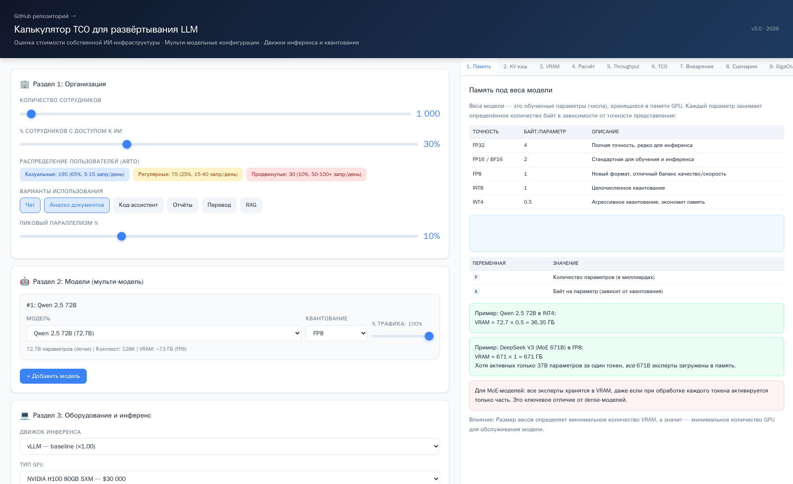
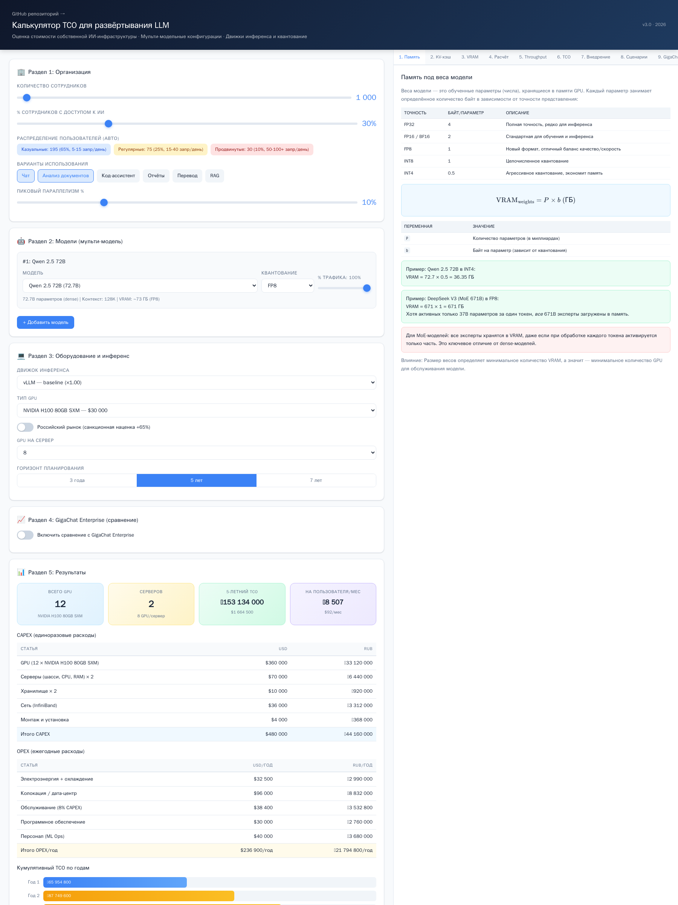

# Калькулятор TCO для LLM-инфраструктуры

Оценка полной стоимости владения при развёртывании больших языковых моделей
на собственных мощностях. Считает количество GPU, CAPEX/OPEX и TCO на горизонт
3–7 лет с учётом выбранной модели, движка инференса и квантования.

**Live demo:** будет добавлен после включения GitHub Pages — см. раздел
«Запуск».

---

## Задача

Компании, задумавшиеся о собственном LLM-стеке, часто приходят к инженерам
с вопросом «а сколько это будет стоить» — и получают в ответ взгляд в потолок
или ссылку на сравнительную таблицу из презентации вендора. Этот калькулятор
отвечает на тот же вопрос более конкретно: при известных входных (число
сотрудников, доля использующих ИИ, пиковая нагрузка, набор моделей, GPU,
движок инференса) он выдаёт количество карт, серверов, CAPEX и OPEX на
3–7 лет.

Типовые ситуации, в которых это полезно:

- Нужно быстро прикинуть бюджет пилота и понять, во сколько упрётся запуск —
  в железо, в электричество или в лицензии.
- Нужно сравнить self-hosted-вариант с коммерческим managed-сервисом
  (в калькуляторе отдельным тумблером — сравнение с GigaChat Enterprise).
- Нужно показать CFO, что 1B параметров ≠ 1 GB VRAM, и почему MoE-модель
  на 400B может работать шустрее 70B dense-модели.
- Нужно объяснить отделу закупок, почему H100 за $30 000 в прайсе
  поставщика внезапно стал стоить $49 500 — санкционная наценка
  включается отдельным тумблером и составляет ×1.65 как среднее
  по параллельному импорту.

## Что умеет

- Мульти-модельные конфигурации — несколько моделей с распределением
  трафика между ними.
- 20+ современных моделей: Qwen3, Llama 4, DeepSeek-V3.2, Kimi K2,
  GLM-4.6, Mistral Large 3, Gemma 3, Phi-4, Command R+, YandexGPT,
  GigaChat и другие.
- 10 вариантов GPU: от H100/H200/B200 до AMD MI300X, Intel Gaudi 3,
  Huawei Ascend 910B и «потребительских» RTX 5090 / RTX 6000 Ada.
- 5 движков инференса с эмпирическими множителями throughput:
  vLLM, SGLang, TensorRT-LLM, HuggingFace TGI, llama.cpp.
- 7 вариантов квантования: FP16, FP8, INT8, INT4, AWQ, GPTQ, GGUF_Q4.
- Раскладка CAPEX по статьям (GPU, шасси, сеть, хранилище, инсталляция)
  и OPEX (питание, колокация, сопровождение, лицензии, персонал).
- Горизонт 3 / 5 / 7 лет, стоимость на одного пользователя в месяц.

## Как пользоваться

1. **Организация.** Задайте число сотрудников, долю пользователей ИИ,
   варианты использования (чат / документы / код / отчёты / перевод / RAG)
   и пиковый параллелизм.
2. **Модели.** Добавьте одну или несколько моделей, выберите квантование
   и распределите трафик между ними в процентах.
3. **Инфраструктура.** Выберите движок инференса, тип GPU, количество GPU
   на сервер и горизонт планирования. При необходимости включите санкционную
   наценку.
4. **Сравнение (опционально).** Включите сравнение с managed-решением —
   калькулятор подсчитает, на каком горизонте self-hosted-вариант окупается
   относительно лицензии.

Результаты пересчитываются на каждое изменение слайдера — никаких кнопок
«рассчитать».

## Скриншоты

Общий вид интерфейса — слева пошаговый калькулятор, справа панель
с методологией и формулами:



Расширенная версия со всеми полями, включая раздел методологии:



## Запуск

```bash
git clone https://github.com/VladimirPirogov13/ai-infrastructure-calculator.git
cd ai-infrastructure-calculator
open index.html          # macOS
xdg-open index.html      # Linux
start index.html         # Windows
```

Для публичного доступа — через GitHub Pages: Settings → Pages → Deploy
from branch → `main` / root. Через пару минут страница будет доступна
по адресу `https://vladimirpirogov13.github.io/ai-infrastructure-calculator/`.

## Методология расчёта

### Количество GPU

Для каждой модели берётся максимум из двух ограничений — по памяти
и по пропускной способности:

$$N_{GPU} = \max\left(\left\lceil \frac{V_{model}}{V_{GPU}} \right\rceil,\; \left\lceil \frac{1.3 \cdot T_{req}}{T_{per\\_GPU}} \right\rceil\right)$$

где:

- $V_{model}$ — объём памяти модели с учётом квантования;
- $V_{GPU}$ — VRAM одной карты;
- $T_{req}$ — требуемый throughput (токен/сек) на всю систему;
- $T_{per\\_GPU}$ — throughput одной карты с учётом движка и квантования;
- коэффициент $1.3$ — запас на KV-cache, буферы и фрагментацию.

### Throughput одной карты

$$T_{per\\_GPU} = T_{base} \cdot k_{GPU} \cdot k_{quant} \cdot k_{engine}$$

- $T_{base}$ — базовый throughput модели (токен/сек на одну H100 FP8 с vLLM);
- $k_{GPU}$ — множитель GPU (H100 = 1.00, H200 = 1.35, B200 = 2.00,
  A100 = 0.60, L40S = 0.40, MI300X = 1.00, Gaudi 3 = 0.85, …);
- $k_{quant}$ — множитель квантования
  (FP8 = 1.00, FP16 = 0.60, INT4 = 1.30, AWQ = 1.10, GPTQ = 1.05, GGUF_Q4 = 0.70);
- $k_{engine}$ — множитель движка
  (vLLM = 1.00, SGLang = 1.15, TensorRT-LLM = 1.40, TGI = 0.95, llama.cpp = 0.50).

### Требуемый throughput

$$T_{req} = \frac{N_{concurrent} \cdot 0.4 \cdot \text{avgOutputTokens}}{t_{latency}}$$

где $N_{concurrent}$ — число одновременных пользователей в пике,
коэффициент $0.4$ — доля активных (обрабатываемых прямо сейчас)
из одновременно подключённых, $t_{latency}$ — целевое время ответа
(по умолчанию 5 сек), а `avgOutputTokens` — среднее число выходных
токенов, зависящее от выбранных вариантов использования.

### CAPEX

$$\text{CAPEX} = k_{sanction} \cdot (N_{GPU} \cdot P_{GPU} + N_{srv} \cdot (P_{chassis} + P_{storage} + P_{network}) + N_{srv} \cdot P_{install})$$

Для сетевой части добавляется InfiniBand-стоимость, если серверов больше
одного. Санкционный множитель $k_{sanction} = 1.65$ применяется к импортному
железу, если включён соответствующий тумблер.

### OPEX

$$\text{OPEX} = N_{srv} \cdot (P_{power} + P_{colo}) + 0.08 \cdot \text{CAPEX} + P_{software} + P_{staff}$$

Питание считается пропорционально заполнению серверов GPU
(частично заполненный сервер всё равно ест базовую часть), а для
российского контура электричество считается по коэффициенту 0.7
относительно мирового уровня.

### TCO

$$\text{TCO} = \text{CAPEX} + H \cdot \text{OPEX}$$

$$\text{Cost per user per month} = \frac{\text{TCO}}{N_{users} \cdot H \cdot 12}$$

где $H$ — горизонт в годах.

## Технологический стек

| Компонент | Что используется |
|-----------|------------------|
| Frontend  | Vanilla JavaScript, нулевые рантайм-зависимости |
| Стили     | CSS custom properties, Grid, Flexbox |
| Формулы   | [KaTeX 0.16.9](https://katex.org/) через CDN |
| Сборка    | Её нет. Один HTML-файл, открывается двойным кликом. |

В эпоху, когда `hello-world` на React тащит 300 МБ `node_modules`,
приятно помнить, что браузер сам умеет довольно много. Вся логика
расчётов — в одном `<script>` на ~500 строк, данные о моделях и
железе — в двух конфигурационных объектах в начале скрипта.
Менять параметры без пересборки — буквально открыть файл в редакторе
и сохранить.

## Поддерживаемые модели

| Модель | Параметры | Архитектура | Контекст |
|--------|-----------|-------------|----------|
| GigaChat 3.1 Ultra | 702B / 36B активных | MoE | 128K |
| GigaChat Lightning | 10B / 1.8B активных | MoE | 256K |
| YandexGPT 5 Pro (оценка) | ~70B | dense | 32K |
| Qwen3-235B-A22B | 235B / 22B активных | MoE | 128K |
| Qwen3-Coder-480B | 480B / 35B активных | MoE | 256K |
| Qwen3-VL-72B | 72B | dense + vision | 128K |
| Qwen3-30B-A3B | 30B / 3B активных | MoE | 128K |
| Qwen3-14B | 14B | dense | 128K |
| Qwen3-8B | 8B | dense | 128K |
| Qwen 2.5 72B / 14B / 7B | 72 / 14 / 7B | dense | 128K / 32K |
| Llama 4 Scout | 109B / 17B активных | MoE | 10M |
| Llama 4 Maverick | 400B / 17B активных | MoE | 1M |
| Llama 3.1 405B / 70B / 8B | 405 / 70 / 8B | dense | 128K |
| DeepSeek-V3.2 | 685B / 37B активных | MoE | 160K |
| DeepSeek-R1-0528 | 685B / 37B активных | MoE | 160K |
| Kimi K2 | 1T / 32B активных | MoE | 128K |
| Kimi K2.5 | 1T / 32B активных | MoE | 256K |
| GLM-4.6 | 355B / 32B активных | MoE | 200K |
| GLM-4.5 | 60B / 30B активных | MoE | 128K |
| Mistral Large 3 | 123B | dense | 128K |
| Mistral Small 3 | 24B | dense | 128K |
| Mixtral 8x7B | 47B / 13B активных | MoE | 32K |
| Mistral 7B | 7B | dense | 32K |
| Gemma 3 27B / 9B | 27 / 9B | dense | 128K |
| Gemma 2 27B | 27B | dense | 8K |
| Phi-4 14B | 14B | dense | 16K |
| Phi-3 14B | 14B | dense | 128K |
| Yi-Lightning | 200B / 20B активных | MoE | 128K |
| Command R+ v2 | 104B | dense | 128K |
| InternLM 2.5 7B | 7B | dense | 32K |

Параметры MoE-моделей (кроме точно раскрытых) — оценочные, основаны на
данных HuggingFace, технических отчётах вендоров и публичных
бенчмарках. Если у вас есть точные цифры — PR приветствуется.

## Поддерживаемое железо

| GPU | VRAM | Пропускная способность HBM | Цена, ориентир |
|-----|------|---------------------------|----------------|
| NVIDIA B200 SXM | 192 GB | 8000 GB/s | $40 000 |
| NVIDIA H200 SXM | 141 GB | 4800 GB/s | $40 000 |
| NVIDIA H100 SXM | 80 GB | 3350 GB/s | $30 000 |
| NVIDIA A100 SXM | 80 GB | 2039 GB/s | $15 000 |
| AMD Instinct MI300X | 192 GB | 5300 GB/s | $15 000 |
| Intel Gaudi 3 | 128 GB | 3700 GB/s | $15 000 |
| Huawei Ascend 910B | 64 GB | 1600 GB/s | $12 000 |
| NVIDIA L40S | 48 GB | 864 GB/s | $8 000 |
| NVIDIA RTX 6000 Ada | 48 GB | 960 GB/s | $6 800 |
| NVIDIA RTX 5090 | 32 GB | 1792 GB/s | $2 500 |

## Движки инференса

| Движок | Множитель | Комментарий |
|--------|-----------|-------------|
| vLLM | ×1.00 | Baseline. PagedAttention, continuous batching, индустриальный стандарт для продакшна. |
| SGLang | ×1.15 | RadixAttention даёт выигрыш на повторяющихся префиксах, лучший выбор для structured output и function calling. |
| TensorRT-LLM | ×1.40 | Только NVIDIA, зато выжимает максимум. Цена — сложнее сборка и меньше гибкость. |
| HuggingFace TGI | ×0.95 | Классика, удобная интеграция с экосистемой HF. В продакшне часто проигрывает vLLM по throughput. |
| llama.cpp | ×0.50 | Для CPU, Apple Silicon и mixed-GPU сценариев. Работает где угодно, но не про максимальный throughput. |

Коэффициенты — усреднённые значения из открытых бенчмарков
(vLLM benchmarks, SGLang paper, ArtificialAnalysis). На конкретной
модели и нагрузке реальное соотношение может отличаться на ±20%.

## Квантование

| Формат | Память | Throughput | Когда имеет смысл |
|--------|--------|------------|-------------------|
| FP16 | ×1.00 | ×0.60 | Дефолт для обучения и fine-tuning. В инференсе почти никогда не оптимален. |
| FP8 | ×0.50 | ×1.00 | Baseline для H100/H200/B200. Минимальная потеря качества, максимальная плотность. |
| INT8 | ×0.50 | ×1.00 | Хорошая опция для A100 и старших картах без FP8. |
| INT4 | ×0.25 | ×1.30 | Сильная компрессия с заметной, но приемлемой потерей качества. |
| AWQ | ×0.25 | ×1.43 | INT4 с умным выбором значимых весов. Де-факто стандарт для компактных деплоев. |
| GPTQ | ×0.25 | ×1.36 | Постфактум-квантование, хорошо поддерживается экосистемой. |
| GGUF_Q4 | ×0.25 | ×0.70 | Формат llama.cpp, для CPU / mixed-GPU / локальных сценариев. |

## Ограничения и допущения

- Это оценка, а не бюджетная заявка. Реальные цифры зависят от
  договорённостей с поставщиком, тарифов на электричество, налоговой
  юрисдикции и десятка других факторов, которые калькулятор не знает.
- Throughput-коэффициенты получены из открытых бенчмарков и справедливы
  в среднем; на конкретной комбинации модель + нагрузка + контекст
  они могут отличаться.
- Цены на GPU — индикативные на момент составления калькулятора
  и меняются регулярно (особенно на потребительские RTX и на
  параллельный импорт).
- Санкционная наценка включается отдельным переключателем и составляет
  ×1.65 — усреднённое эмпирическое значение по рынку параллельного
  импорта в РФ.
- Параметры MoE-моделей, не раскрытые официально (в частности
  YandexGPT 5 Pro), указаны как приближённые оценки.

## Roadmap

- [ ] Импорт/экспорт сценариев в JSON
- [ ] Side-by-side сравнение нескольких конфигураций
- [ ] Учёт стоимости fine-tuning (DPO / LoRA)
- [ ] График нагрузки по времени суток и автоскейл
- [ ] Интеграция с актуальными прайсами облачных GPU (Selectel,
      Cloud.ru, VK Cloud, Yandex Cloud)
- [ ] Опция гибридного деплоя (часть на своём железе, пики — в облаке)
- [ ] Калькулятор энергопотребления и углеродного следа

## Лицензия

MIT — см. [LICENSE](LICENSE).

---

Автор: Владимир Пирогов · [GitHub](https://github.com/VladimirPirogov13)
